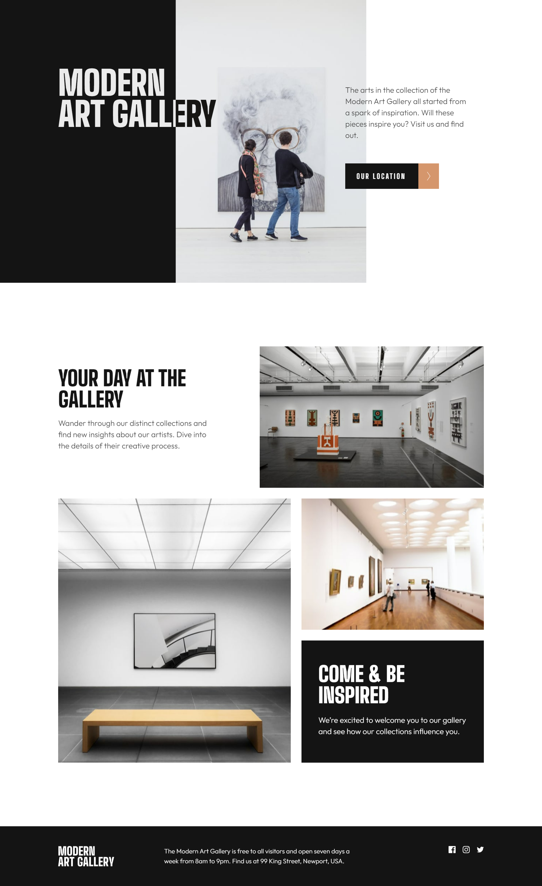
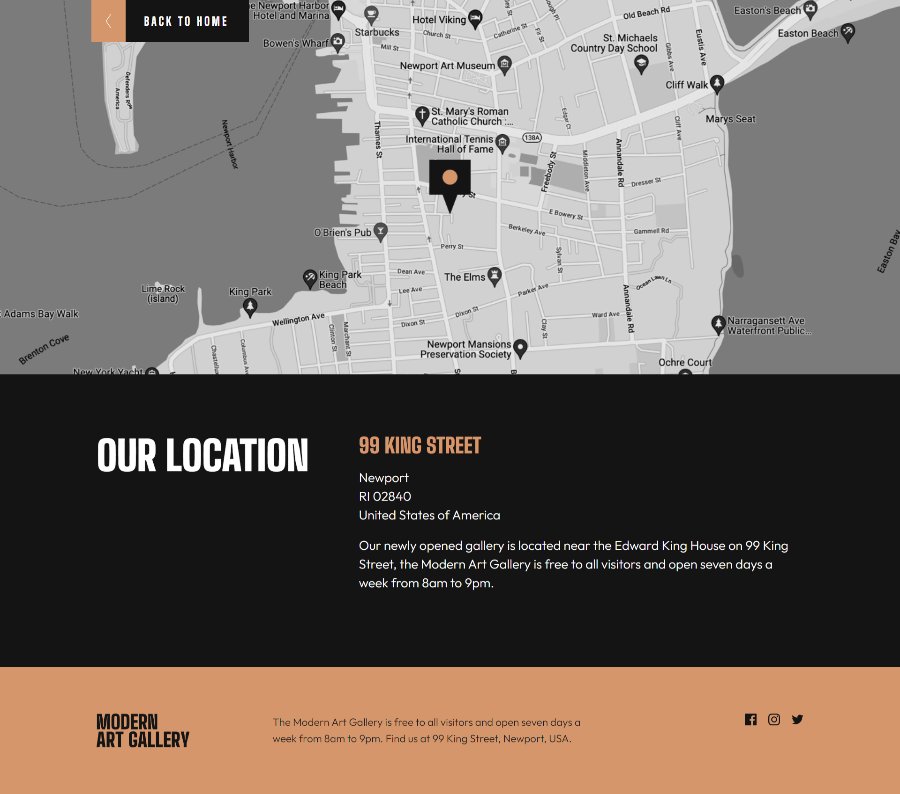

# Frontend Mentor - Art gallery website solution

This is a solution to the [Art gallery website challenge on Frontend Mentor](https://www.frontendmentor.io/challenges/art-gallery-website-yVdrZlxyA). Frontend Mentor challenges help you improve your coding skills by building realistic projects. 

## Table of contents

- [Overview](#overview)
  - [The challenge](#the-challenge)
  - [Screenshot](#screenshot)
  - [Links](#links)
- [My process](#my-process)
  - [Built with](#built-with)
  - [What I learned](#what-i-learned)
  - [Continued development](#continued-development)
- [Author](#author)

## Overview

### The challenge

Users should be able to:

- View the optimal layout for each page depending on their device's screen size
- See hover states for all interactive elements throughout the site

### Screenshot

 

### Links

- Solution URL: [Frontend Mentor](https://www.frontendmentor.io/solutions/art-gallery-website-responsive-without-frameworks-3AB3MhAhIx)
- Live Site URL: [Live page](https://sircarloschaves.github.io/art-gallery-website/)

## My process

### Built with

- Semantic HTML5 markup
- CSS custom properties
- Flexbox
- CSS Grid
- Mobile-first workflow

### What I learned

It was my first time making a landing page with two pages, so I learned how to structure them.
I also learned how to use the mix-blend-mode property.

### Continued development

I will continue to improve my layouts, and as I improve with Javascript I will start using it in my projects.

## Author

- Github - [sircarloschaves](https://github.com/sircarloschaves)
- Frontend Mentor - [@sircarloschaves](https://www.frontendmentor.io/profile/sircarloschaves)
- Twitter/X - [@carloschavesdev](https://twitter.com/carloschavesdev)